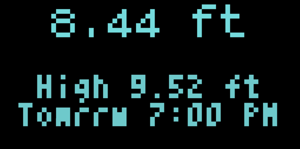
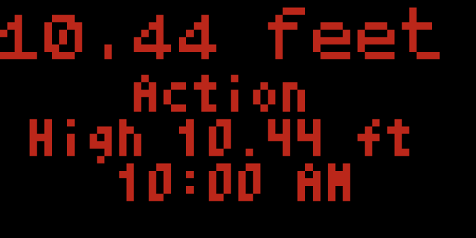

# tidbyt-river-level-display
Show your chosen river level and predicted high water level on Tidbyt display, using data from the National Weather Service.

## Quick start
1. Install [`pixlet`](https://github.com/tidbyt/pixlet)
2. Run `pixlet serve riverlevel.star`
3. Go to [http://localhost:8080](http://localhost:8080)
    1. `?gauge=ltln6` can be passed to display non-default gauge.
4. Find your local gauge at https://water.weather.gov/ahps/
5. You may want to change your default gauge on line 13

